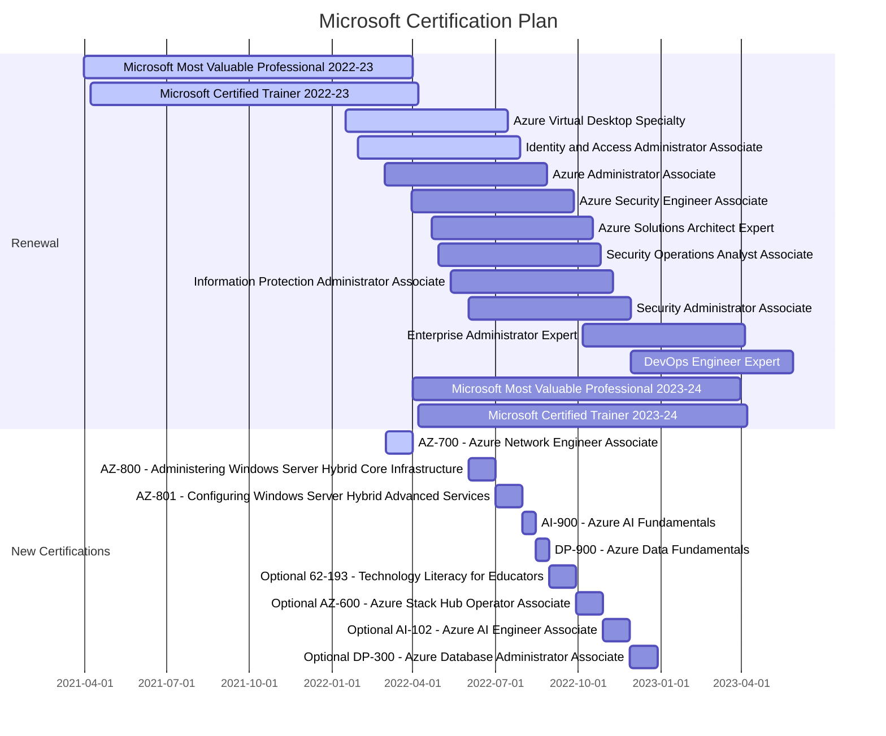

### Hi there 👋

My name is Vukasin. I am a digital nomad traveling around the world, while working as a Cloud Solution Architect. I am not a developer, but I do like to write code and automate everything I can.

I am also a Microsoft Azure Most Valuable Professional (#MVPBuzz) and Microsoft Certified Trainer. I like creating Infrastructure as a Code, working with Windows server, hyperconverged infrastructures, and Azure ☁️

Away from keyboard, I enjoy activities like scuba diving and free diving, kite surfing and wind surfing, paddle boarding, beach cleaning, volunteering to help animals. I'm a father of a beautiful girl. I enjoy coffee ☕️ I love ocean and where ever I go I always come back to it.

### 📫  Let's get in touch:

### 🤙 You can also schedule 1:1 with me to discuss Azure (free 30min consultation)

### 📝 Latest from the blog:

<!-- AzureIs.Fun:START -->
- [Azure Policy ideas for Azure Governance](https://azureis.fun/posts/Azure-Policy-ideas-for-Azure-Governance/)
- [Azure CLI Tip Of The Day - January 2022](https://azureis.fun/posts/Azure-CLI-Tip-Of-The-Day-1-31/)
- [Rotate Azure VM Passwords with PowerShell and Key Vault](https://azureis.fun/posts/Rotate-Azure-VM-admin-password-with-PowerShell-and-KeyVault/)
- [Update your Azure Automation Accounts to use Managed Identity instead of RunAs Account](https://azureis.fun/posts/Update-Azure-Automation-Account-To-Use-Managed-Identity/)
- [Cleaning up Azure Resource Tags](https://azureis.fun/posts/Cleaning-Up-Azure-Resource-Tags/)
- [Azure Naming Policy](https://azureis.fun/posts/Azure-Naming-Policy/)
- [Registering Hyper-V Servers with a different Azure Migrate project](https://azureis.fun/posts/Registering-HyperV-Servers-With-A-Different-Azure-Migration-Project/)
- [Simplify Your Resource Deployments With Azure Bicep](https://azureis.fun/posts/Simplify-Your-Resource-Deployments-With-Azure-Bicep/)
- [Moving Managed Disks to different Azure Region](https://azureis.fun/posts/Moving-Managed-Disks-To-Different-Azure-Region/)
- [Azure Dashboards for Azure Governance](https://azureis.fun/posts/Azure-Dashboards-for-Azure-Governance/)
<!-- AzureIs.Fun:END -->

<!--
**vukasinterzic/vukasinterzic** is a ✨ _special_ ✨ repository because its `README.md` (this file) appears on your GitHub profile.

Here are some ideas to get you started:

- 🔭 I’m currently working on ...
- 🌱 I’m currently learning ...
- 👯 I’m looking to collaborate on ...
- 🤔 I’m looking for help with ...
- 💬 Ask me about ...
- 📫 How to reach me: ...
- 😄 Pronouns: ...
- ⚡ Fun fact: ...
-->
