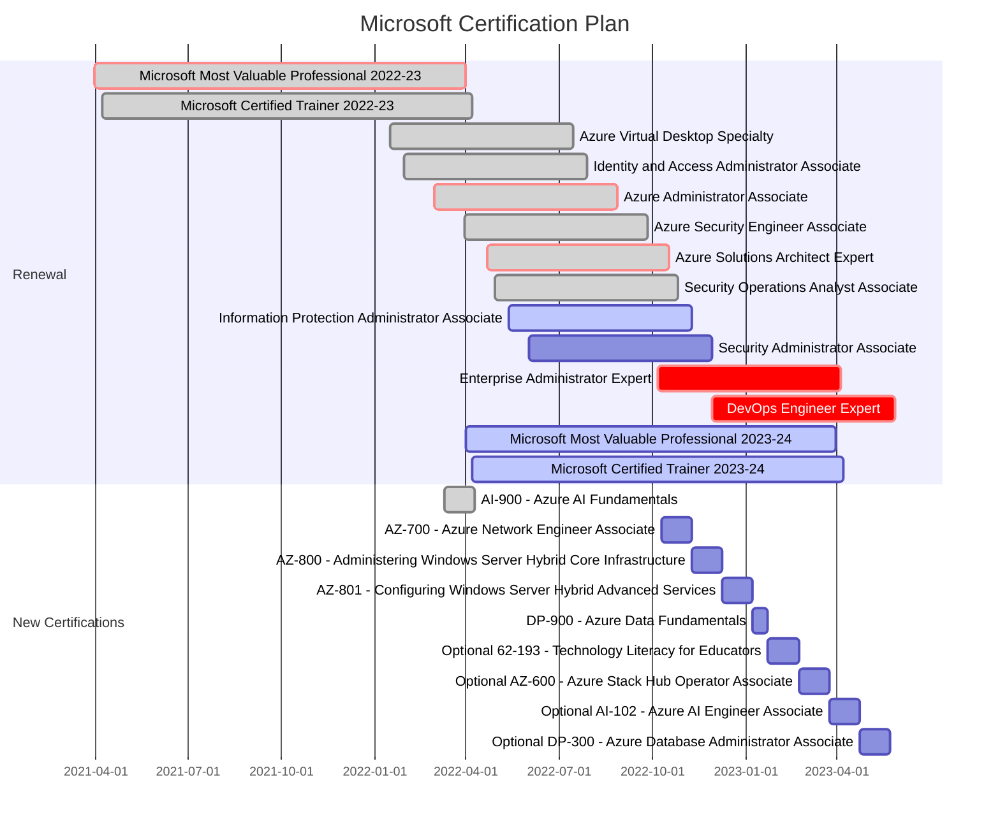

### Hi there 👋

My name is Vukasin. I am a digital nomad traveling around the world while working as a Senior Cloud Architect. I am not a developer, but I do like to write code and automate everything I can.

I am also a Microsoft Azure Most Valuable Professional (#MVPBuzz). I like creating Infrastructure as a Code, working with Windows Server, hyperconverged infrastructures, and Azure ☁️ I also like to make various 3D printing and Electronics projects.

Away from the keyboard, I enjoy activities like scuba diving and free diving, kite surfing and windsurfing, paddle boarding, beach cleaning, and volunteering to help animals. I'm the father of a beautiful girl. I enjoy coffee ☕️ I love the ocean and wherever I go I always come back to it.

### 📫  Let's get in touch:

### 🤙 You can also [schedule 1:1 meeting with me](http://calendly.com/vukasin-terzic) to discuss Azure (free 30min consultation)

### 📝 Latest articles from my blog:

<!-- AzureIs.Fun:START -->
- [Deploy Azure Monitor With Terraform](https://azureis.fun/posts/Deploy-Azure-Monitor-With-Terraform/)
- [Get VM SKU Availability in Azure Availability Zones](https://azureis.fun/posts/Get-VM-SKU-Availability-in-Azure-Zones/)
- [Understanding And Overcoming Azure VM SKU Capacity Limitations](https://azureis.fun/posts/Undrstanding-And-Overcoming-Azure-VM-SKU-Capacity-Limitations/)
- [Azure Network Peering diagram with PowerShell](https://azureis.fun/posts/Visualize-Azure-Network-Peering-With-PowerShell/)
- [Diagram as Code with PowerShell](https://azureis.fun/posts/Diagram-as-Code-with-PowerShell/)
- [Automating Azure VM Snapshots](https://azureis.fun/posts/Automating-Azure-VM-Snapshots/)
- [Understanding Physical and Logical Azure Availability Zones](https://azureis.fun/posts/Understanding-Physical-and-Logical-Azure-Availability-Zones/)
- [When and How to Use Azure Resource Locks Without Causing Yourself Trouble](https://azureis.fun/posts/When-and-How-To-Use-Azure-Locks-Without-Trouble/)
- [How To Create And Use Terraform Modules](https://azureis.fun/posts/How-To-Create-And-Use-Terraform-Modules/)
- [Writing your first Azure Terraform Configuration](https://azureis.fun/posts/Writing-your-first-Azure-Terraform-Configuration-Template/)
<!-- AzureIs.Fun:END -->

<!--

**vukasinterzic/vukasinterzic** is a ✨ _special_ ✨ repository because its `README.md` (this file) appears on your GitHub profile.

Here are some ideas to get you started:

- 🔭 I’m currently working on ...
- 🌱 I’m currently learning ...
- 👯 I’m looking to collaborate on ...
- 🤔 I’m looking for help with ...
- 💬 Ask me about ...
- 📫 How to reach me: ...
- 😄 Pronouns: ...
- ⚡ Fun fact: ...
-->
